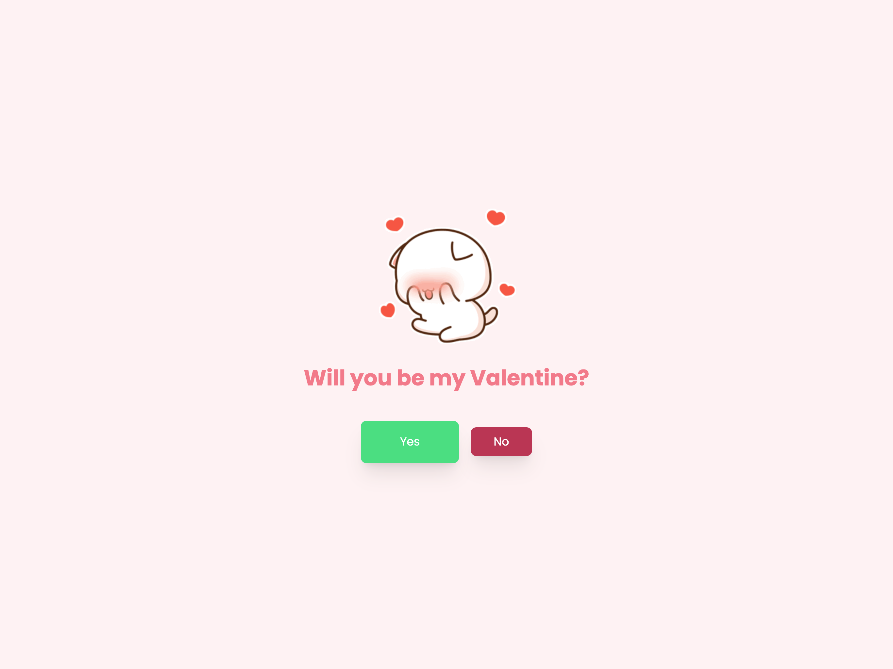

# Ask Valentine Website

Ask someone to be your Valentine this year! Send them a link to this website and they will be asked to answer one simple question.

	
Screenshots

	
	
	
	

## Self-hosting

You can self-host this website by following these steps:

1. Clone this repository
2. Install the dependencies with `npm install` or `pnpm install`
3. Build the website with `npm run build` or `pnpm build`
4. Serve the website with something like Apache/Nginx, or using `npm run start` or `pnpm start`

## License

Made by [Johan](https://johanstick.fr). You can use this project the way you want, including modifying it. Feel free to credit me if you want to!